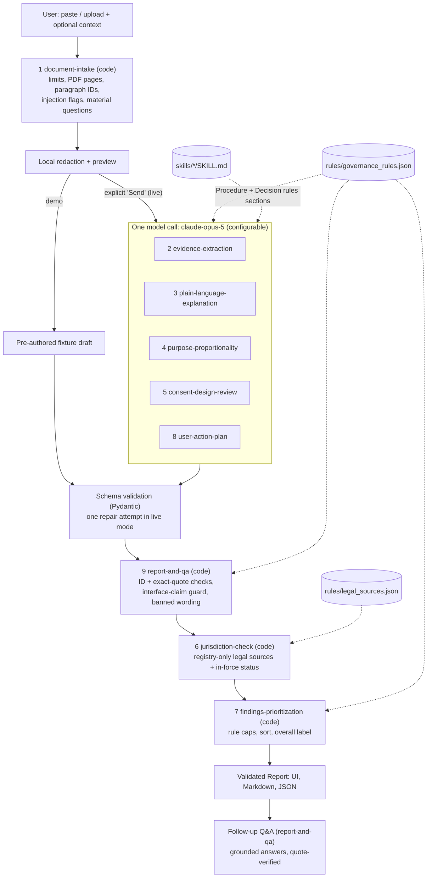

# Architecture

## One orchestrator, nine skills, one rule source



Plain-text version:
```
input -> [1 intake] -> redaction/preview -> (live: confirm & send | demo: fixture)
      -> one model call running skills 2,3,4,5,8   (prompt = orchestrator_system.md + SKILL.md sections + rule table)
      -> schema validation (1 repair max)
      -> [9 report QA: IDs, quotes, guards] -> [6 jurisdiction check] -> [7 prioritization]
      -> validated Report -> UI / Markdown / JSON -> grounded follow-up Q&A
```

## Why this shape
- **Logical skills, not many agents.** The brief asks for a reliable workflow, not autonomous agents. One model call keeps cost and latency low and avoids errors compounding between agents. The skills remain separate, reusable units of instruction and code.
- **Code where reliability matters.** Exact-quote checks, severity caps, legal-source attachment, and labels are deterministic and unit-tested. The model handles reading comprehension and plain-language writing.
- **The model cannot set legal sources, overall labels, finding IDs, or validation results.** The model-output contract (`AnalysisDraft`) has no fields for them, and unknown fields are rejected (`extra="forbid"`).
- **Demo and live share one pipeline.** Demo fixtures are the same contract the model fills, so demos exercise the real validation path, and tests check that fixture quotes verify.

## Data contracts
| Contract | Python | JSON Schema |
|---|---|---|
| Supplied context + intake | `SuppliedContext`, `IntakeResult` | `schemas/intake.schema.json` |
| Evidence | `Paragraph` | `schemas/evidence.schema.json` |
| Skill results (model output) | `AnalysisDraft` | `schemas/analysis_draft.schema.json`, `draft_finding.schema.json` |
| Findings | `Finding` | `schemas/finding.schema.json` |
| Report | `Report` | `schemas/report.schema.json` |
| Source registry | `LegalSource` | `schemas/legal_source.schema.json`, `source_registry.schema.json` |
| Follow-up answers | `QAAnswer` | `schemas/qa_answer.schema.json` |

Schemas are generated (`python -m src.export_schemas`), and a test fails if they drift from the models.

## Live-mode reliability
- Anthropic Python SDK `anthropic>=1.12`, streaming via `client.beta.messages.stream(...).get_final_message()`, client timeout 300 s, SDK `max_retries=2`, `max_tokens=32000`.
- Server-side refusal fallback (`fallbacks="default"`, beta `server-side-fallback-2026-07-01`) for Opus 5 and Fable models. Disable it with `CONSENTGUARD_FALLBACKS=off`.
- `stop_reason` of `refusal` or `max_tokens` causes a visible error, with no partial report.
- Invalid JSON gets one repair turn that includes the validation error, then fails. A failure never falls back to demo content.

## Canonical sources of truth
| What | Where | Read by |
|---|---|---|
| Rule IDs, versions, caps, permission guidance, banned wording | `rules/governance_rules.json` | `src/rules.py`, prompt builder, fallback bundle |
| Legal sources and effective dates | `rules/legal_sources.json` | `src/rules.py::attach_legal_sources` |
| Skill procedures | `skills/*/SKILL.md` | prompt builder (model skills), humans, Claude |
| Orchestrator behaviour | `prompts/orchestrator_system.md` | prompt builder |
